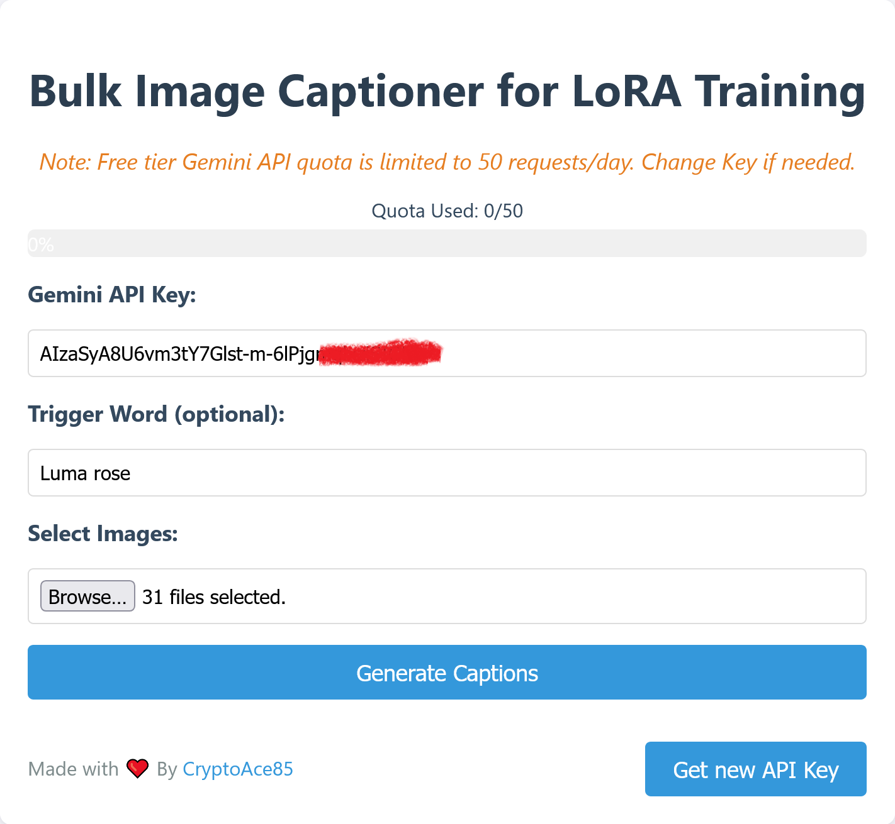
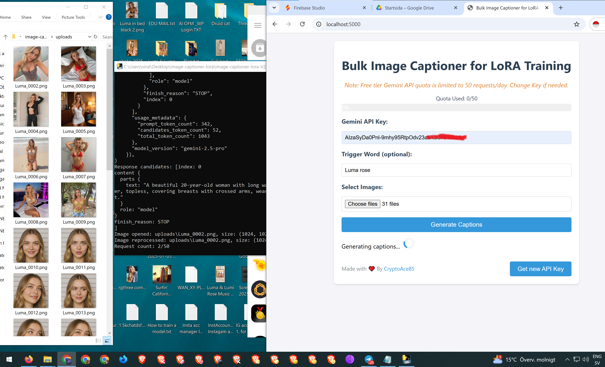
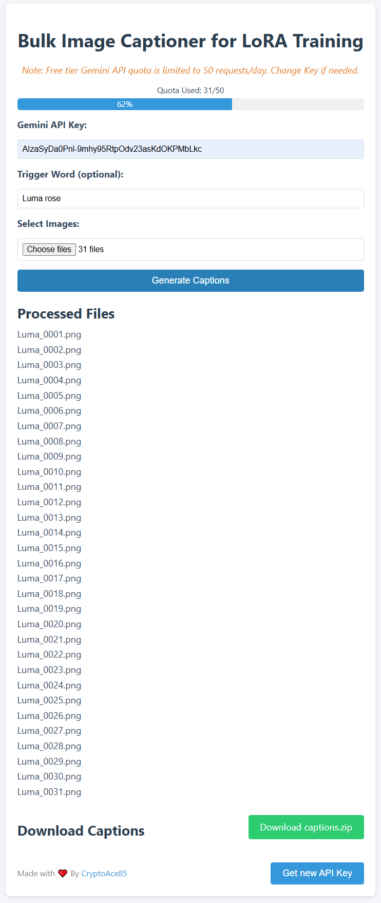
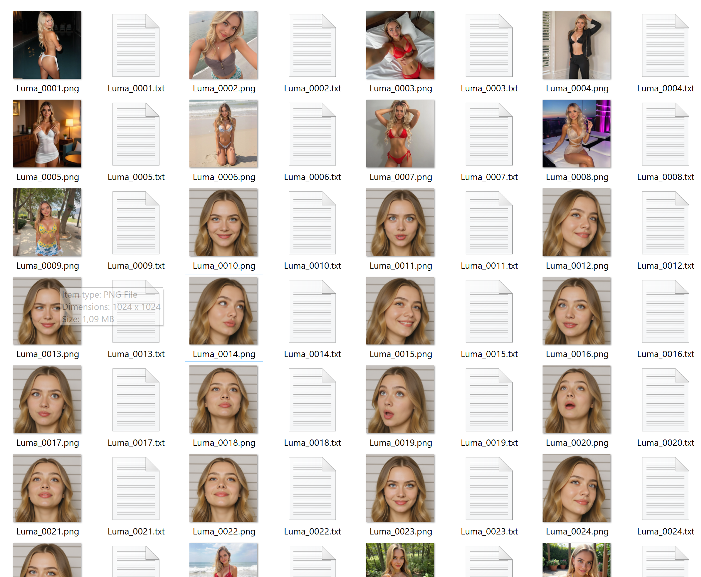

# Bulk Image Captioner for LoRA Training V2-Windows-edition
## (NSFW Enabled & specialized for female LoRAs)

A Windows web app for generating image captions for LoRA training, 
using the Gemini-2.5-pro model. 
Users can input their Gemini API key and a custom trigger word via the web interface.
## Features:
Upload multiple images (.png, .jpg, .jpeg) and generate detailed captions.
Specify a trigger word (e.g., "skw style") for LoRA training.
Provide your Gemini API key securely through the web interface.
Download captions as a .zip file with .txt files matching image names

## image-captioner-lora-V2-Windows-edition

## The app is to big to be placed here but can be downloaded from my Google drive:
# 📥 **[Download the Windows App](https://drive.google.com/file/d/1-A5e-7vH80nVL8n6V7751jUJhP14-mCJ/view?usp=drive_link)** 💻

---------------------------------------------------------------------------------------
## Usage & Getting Gemini API Key:

- Run `app.exe` to start the server.
- Get a Gemini API key at: (https://makersuite.google.com/)
- if Gemini API key is region blocked its because its the server you connected to is in wrong destination, test with another gmail
- when u find a gmail that works you can create one Key,
  and to create more keys with same Gmail make several projects that needs a Gemini key with that gmail in
  (https://studio.firebase.google.com/)

- Explaination video to make several keys:  (https://www.youtube.com/watch?v=IdVgDHeNiEM)

- Enter your Gemini API key and select images.
- Optionally enter a trigger word (leave blank for no prefix, or enter e.g., 'Rose' to prepend).
- Click "Generate Captions" to process images and download the ZIP file.
- The app creates `uploads` and `captions` folders in the same directory.
- Free Gemini API Quota: 50 requests/day, resets at 2:00 AM CEST.
-----------------------------------------------------------------------------------------
## App Usage Note:

   In the app destination folder i recomend to open 
   the "uploads" folder to see the images you upload 
   and for every image prosessed the images will dissapear 
   from the folder so you see how long process it left, test with a few images first to check your API key

 # Screenshots
## 1.👇

## 2.👇

## 3.👇
  
*Enter your Gemini API key, (Optional) Enter a trigger word (e.g., "Luma rose"), Upload images and click "Generate Captions". Download captions.zip for LoRA training.*

 ## Generated .TXT files for images
## 4.👇

*Example of Luma_0003.txt:  Luma rose, A beautiful 20-year-old woman, smiling, direct gaze, blue eyes, blonde hair, taking a selfie while lying on her back, hand on stomach, slim body, toned abs, wearing red sheer lingerie, red bra, red panties, in bed, white sheets, bedroom.*

*Example of Luma_0006.txt: Luma rose, A beautiful 20-year-old woman with a slight smile, looking at viewer, kneeling on a sandy beach, long blonde hair, large breasts, cleavage, toned body, wearing a white and blue printed string bikini, ocean background, daylight.*

*Example of Luma_0019.txt: Luma rose, A beautiful 20-year-old woman, surprised expression, looking up, open mouth, closeup on face, blonde wavy hair, blue eyes, pink lipstick, against a white striped wall.*
